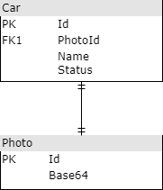

# Avaliação FullStack
Olá desenvolvedor!\
Tudo bem?! 😊\
\
Seja bem-vindo, o intuito do teste não é reprovar e sim conhecer seu melhor estilo de programar e resolver problemas.

## O que fazer no Back-end
1. Disponibilizaremos uma máquina windows para hospedar a API([Web App](https://docs.microsoft.com/pt-br/aspnet/core/web-api/?WT.mc_id=dotnet-35129-website&view=aspnetcore-6.0)) e enviaremos o [perfil de publicação](https://docs.microsoft.com/pt-br/visualstudio/deployment/quickstart-deploy-aspnet-web-app?view=vs-2022&tabs=import-profile) para o desenvolvimento da API. Também será disponibilizado um banco de dados [Azure SQL Server](https://docs.microsoft.com/pt-br/azure/azure-sql/azure-sql-iaas-vs-paas-what-is-overview?view=azuresql) com seu usuário e senha para o desenvolvimento do banco.
2. Crie um repositório no GitHub para a API.
3. Use esse repositório para desenvolver a API.
4. Com o banco de dados SQL Server enviado pela Ímpar, criar a estrutura a partir da seguinte UML:\

5. Fazer uma API onde ela consuma o banco de dados e disponibilize a informação pro Front-end.
6. A API deve ter sistema de paginação de itens. Ex: trazer de 10 em 10 itens. 
7. A API deve ser construída em .NET 5/6
8. Publicar essa API na máquina disponibilizada pela Ímpar com o perfil de publicação.
## O que fazer no Front-end
1. Crie um repositório no GitHub para o Front-end.
2. Use esse repositório para desenvolver o Front-end.
3. Replicar o layout do link abaixo:\
[Link para o layout](https://xd.adobe.com/view/c715f110-fbd4-4323-be0c-0e453c1450db-9246)
4. Utilizar a API criada e publicada para trazer os itens e renderizar nos cards da melhor forma possível. No card precisa ser renderizado Nome, Status e imagem.
5. Implementar a funcionalidade de busca na melhor forma possível com a API criada e publicada.
6. Implementar a funcionalidade de paginação(carregar mais) dos cards na melhor forma possível com a API criada e publicada.
7. Fazer o CRUD(editar/excluir/novo card) da melhor forma possível com a API criada e publicada.

## Ao finalizar o código
1. Publicar a API na máquina disponibilizada através do perfil de publicação.
2. Crar um README na raiz do repositório do Front-end com as instruções de como podemos fazer o seu código rodar na nossa máquina. Ou seja, passo a passo do que instalar e de quais comandos rodar para podermos visualizar o seu trabalho!
3. Enviar um e-mail para processoseletivo@impar.com.br com o assunto "Avaliação FullStack", informando que finalizou a avaliação e colocando os links dos seus repositórios GitHub com o código feito da API e do Front-end. 

## Dicas
* Gostamos de interfaces limpas e elegantes.
* Gostamos das camadas bem definidas no Back-end, o mínimo do DDD.

## Quais tecnologias usar
* Deixaremos que no Front-end fique ao seu critério qual tecnologia utilizar no entanto você terá mais pontos conosco se utilizar React para criação da interface. No Back-end a API deverá ser construída em .Net 5/6.

## Desafios se você se sentir confiante
* Utilizar OData ou GraphQL na API e consumir no front usando o poder do OData/GraphQL.
